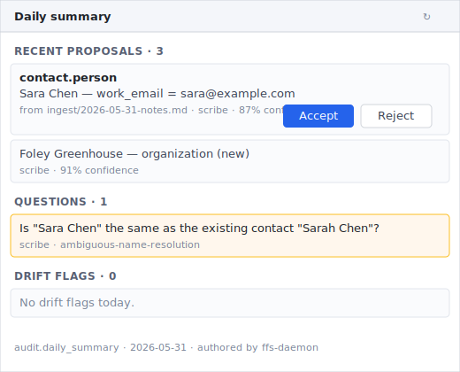
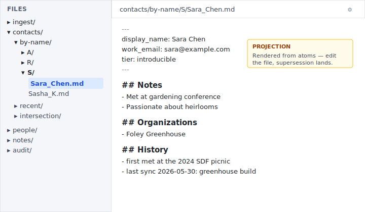
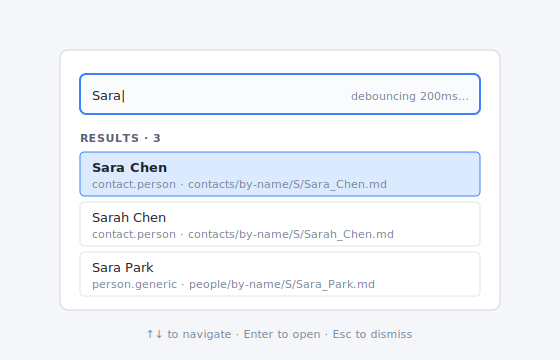

# First-use guide — your first day with FFS

Welcome. If you're reading this, your technical friend has
installed FFS on your machine and walked you through the
[setup checklist](technical-friend-checklist.md). This document
is your turn-by-turn for using it.

You will not need a terminal for any of this. Everything happens
in Obsidian.

> Estimated time: **30 minutes**, taken at your own pace.

## What FFS is, briefly

Your knowledge — contacts, notes, project records — lives as
*atoms*: signed, timestamped, capability-classified statements
about things. The substrate renders those atoms into Markdown
files you can read and edit in Obsidian. When you edit a file,
the substrate notices, figures out what changed, and writes a
new atom that supersedes the old one. Nothing is overwritten;
everything is auditable; you own all of it.

You don't have to think about any of that to use it. What
follows is what you actually do.

## 1. Capture a contact (5 min)

In Obsidian, navigate to `ingest/` (it lives at the root of your
vault, under `~/.ffs/ingest/` on Linux/macOS or `C:\Users\<you>\
.ffs\ingest\` on Windows).

Create a new note. Type freely — names, contact details,
anything you remember. For example:

```markdown
Met Sara Chen at the gardening conference yesterday. Works at
Foley Greenhouse. Passionate about heirloom tomatoes. Email
sara@example.com — she said she'd send photos of the seedlings.
```

Save the file. Within a few seconds, the **scribe** skill reads
it and produces one or more *proposals* — its best guess at
which atoms should be created. You won't see anything change
yet; proposals live in a queue until you review them.

## 2. Review the daily summary (5 min)

Open the **Daily summary** panel in the right sidebar. (If you
don't see it, run the command **FFS: Refresh daily summary
panel**.)

The panel shows three categories:

- **Recent proposals** — what scribe extracted from your ingest
  notes, awaiting your review.
- **Questions** — places the scribe wasn't sure (ambiguous name
  resolution, missing context).
- **Drift flags** — files where someone edited the projection
  but the change couldn't be mapped back automatically.

> 

Each entry has an **Accept** and a **Reject** button. Read the
proposal — "Sara Chen, work_email=sara@example.com" — and click
**Accept**. The proposal becomes a real, signed atom in your
substrate.

Repeat for the other proposals scribe extracted from your note.
The whole flow should take 30 seconds per contact.

## 3. Find your new contact (3 min)

In Obsidian's file explorer, navigate to:

```
contacts/by-name/S/
```

There it is: `Sara_Chen.md`. Open it.

```markdown
---
display_name: Sara Chen
work_email: sara@example.com
---

## Notes
- Met at gardening conference
- Passionate about heirlooms
```

This file is a *projection*. It is rendered on demand from your
atoms; the file on disk and the underlying atoms are kept in
sync. You can read it, edit it, link to it from other notes,
move it around in Obsidian's sidebar — all the things you do
with any Markdown file.

> 

## 4. Edit a contact (5 min)

Fix a typo or add a detail. For example, change `sara@example
.com` to `sara@foley-greenhouse.com`.

Save. Within ~200ms (you'll see Obsidian's gutter blink), the
substrate notices, classifies your edit as a *trivial change to
a frontmatter field*, and writes a supersession atom. The
projection re-renders; the file on disk reflects the new value.

Add a new bullet under `## Notes`:

```markdown
- last sync 2026-05-31: discussed greenhouse build with her
```

Save. Same thing — supersession atom written, projection
re-renders. The old notes are still in your history; the new
note joins them.

> **What about bigger edits?** If you reorganize the file
> significantly (move sections around, delete a paragraph,
> reword a frontmatter value into something the substrate can't
> parse), the substrate routes the edit to ingest for your
> review. You'll see it in tomorrow's daily summary as a *drift
> flag*, and you can Accept or Reject the proposed
> reconciliation just like you did for a new contact.

## 5. Search for someone (2 min)

Run the command **FFS: Focus entity search** (use whatever
hotkey you bound it to).

A search bar appears. Type "Sara" — within 200ms you'll see
matching entities ranked by recency. Press Enter on the one you
want; Obsidian opens its projection.

> 

Try a partial name, an organization, a tag. The search hits
display names, titles, and tag values across every registered
predicate type.

## 6. Browse what you have (5 min)

The path library is opinionated about layout. Some folders to
explore:

| Path | What's there |
|---|---|
| `contacts/by-name/<letter>/` | Contacts grouped alphabetically. |
| `contacts/recent/` | Contacts you've touched recently. |
| `people/by-name/<letter>/` | Generic person records (not part of your contact graph). |
| `notes/by-name/<letter>/` | Your free-form notes. |
| `audit/daily/<date>.md` | Each day's auditor summary as a rendered Markdown file. |

You can bookmark any of these in Obsidian's sidebar.

## 7. Federate with a friend (when you're ready)

If a friend also runs FFS, your technical helper can pair the
two substrates. See [the technical-friend
checklist](technical-friend-checklist.md#step-6--federation-handshake-15-min)
for what they need to do; for you, the experience is:

- Their contacts appear in `contacts/from/<friend>/`.
- Contacts you both have land in
  `contacts/intersection/with/<friend>/`.
- You can revoke the relationship at any time; their view of
  your contacts disappears.

The federation panel in Obsidian shows current bridges and lets
you flip a bridge off with one click. For MVP, walking through
the initial handshake still needs the technical friend; once
established, day-to-day federated use is in-Obsidian.

## What to do when something looks wrong

- **A proposal looks weird.** Reject it. The scribe is
  guessing; you have the final word.
- **A contact card shows old information.** Look at the file —
  is the projection out of date? Run the command **FFS:
  Re-render projection**. If that doesn't help, your technical
  friend can help by inspecting the atom history (`ffs cat
  ffs://_root_/by-entity/<id>`).
- **Daily summary is empty when you expect proposals.** Wait a
  few seconds and run **FFS: Refresh daily summary panel**.
  Scribe might still be processing.
- **Obsidian says it can't reach the daemon.** Your technical
  friend should check [`troubleshooting.md`](troubleshooting.md).

## What now?

Use it. Capture things as they happen. Look at the daily
summary once a day, accept the proposals that look right, reject
the ones that don't. The substrate gets denser and more useful
the more you put into it; it never gets worse, because nothing
is lost.

For the deeper "why" behind FFS, the [project
README](../../README.md) is the best starting point.
