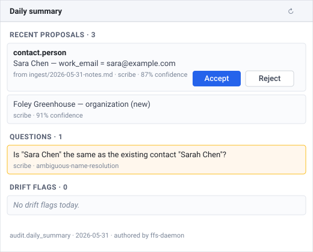
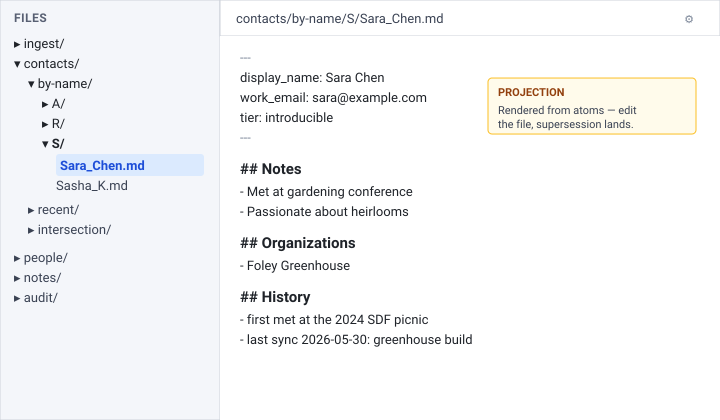
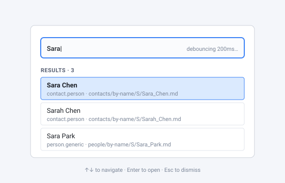

# First-use guide — your first day with FFS

Welcome. If you're reading this, your technical friend has
installed FFS on your machine and walked you through the
[setup checklist](technical-friend-checklist.md). This document
is your turn-by-turn for using it.

You will not need a terminal for any of this. Everything happens
in Obsidian.

> Estimated time: **30 minutes**, taken at your own pace.

## What FFS is, briefly

Your knowledge — contacts, notes, project records — lives as
*atoms*: signed, timestamped, capability-classified statements
about things. The substrate renders those atoms into Markdown
files you can read and edit in Obsidian. When you edit a file,
the substrate notices, figures out what changed, and writes a
new atom that supersedes the old one. Nothing is overwritten;
everything is auditable; you own all of it.

You don't have to think about any of that to use it. What
follows is what you actually do.

## 0. Open your FFS vault in Obsidian (one-time, 1 min)

The substrate lives at `~/.ffs/` on Linux/macOS (or
`C:\Users\<you>\.ffs\` on Windows). That same directory is your
Obsidian vault — there's only one root.

In Obsidian: top-left vault switcher → **Open another vault** →
**Open folder as vault** → navigate to `~/.ffs/` → Open. If a
"trust author" dialog appears for community plugins, **Trust**.

Then Settings → **Community plugins** → toggle the **FFS** plugin
on. The Daily Summary panel appears in the right sidebar.

> Why one root? FFS materializes contacts, notes, and the daily
> summary into your vault as real Markdown files. If your vault
> were somewhere else, Obsidian's file explorer wouldn't see them.

## 1. Capture a contact (5 min)

In Obsidian, navigate to `ingest/` in the file explorer (it's at
the top of your vault, since the vault is `~/.ffs/`).

Create a new note. Type freely — names, contact details,
anything you remember. For example:

```markdown
Met Sara Chen at the gardening conference yesterday. Works at
Foley Greenhouse. Passionate about heirloom tomatoes. Email
sara@example.com — she said she'd send photos of the seedlings.
```

Save the file. Within a few seconds, the **scribe** skill reads
it and produces one or more *proposals* — its best guess at
which atoms should be created. You won't see anything change
yet; proposals live in a queue until you review them.

## 2. Review the daily summary (5 min)

Open the **Daily summary** panel in the right sidebar. (If you
don't see it, run the command **FFS: Refresh daily summary
panel**.)

The panel shows three categories:

- **Recent proposals** — what scribe extracted from your ingest
  notes, awaiting your review.
- **Questions** — places the scribe wasn't sure (ambiguous name
  resolution, missing context).
- **Drift flags** — files where someone edited the projection
  but the change couldn't be mapped back automatically.

> 

Each entry has an **Accept** and a **Reject** button. Read the
proposal — "Sara Chen, work_email=sara@example.com" — and click
**Accept**. The proposal becomes a real, signed atom in your
substrate.

Repeat for the other proposals scribe extracted from your note.
The whole flow should take 30 seconds per contact.

## 3. Find your new contact (3 min)

In Obsidian's file explorer, navigate to:

```
contacts/by-name/S/
```

There it is: `Sara_Chen.md`. Open it.

```markdown
---
display_name: Sara Chen
work_email: sara@example.com
---

## Notes
- Met at gardening conference
- Passionate about heirlooms
```

This file is a *projection*. It is rendered on demand from your
atoms; the file on disk and the underlying atoms are kept in
sync. You can read it, edit it, link to it from other notes,
move it around in Obsidian's sidebar — all the things you do
with any Markdown file.

> 

## 4. Edit a contact (5 min)

Fix a typo or add a detail. For example, change `sara@example
.com` to `sara@foley-greenhouse.com`.

Save. Within ~200ms (you'll see Obsidian's gutter blink), the
substrate notices, classifies your edit as a *trivial change to
a frontmatter field*, and writes a supersession atom. The
projection re-renders; the file on disk reflects the new value.

Add a new bullet under `## Notes`:

```markdown
- last sync 2026-05-31: discussed greenhouse build with her
```

Save. Same thing — supersession atom written, projection
re-renders. The old notes are still in your history; the new
note joins them.

> **What about bigger edits?** If you reorganize the file
> significantly (move sections around, delete a paragraph,
> reword a frontmatter value into something the substrate can't
> parse), the substrate routes the edit to ingest for your
> review. You'll see it in tomorrow's daily summary as a *drift
> flag*, and you can Accept or Reject the proposed
> reconciliation just like you did for a new contact.

## 5. Search for someone (2 min)

Run the command **FFS: Focus entity search** (use whatever
hotkey you bound it to).

A search bar appears. Type "Sara" — within 200ms you'll see
matching entities ranked by recency. Press Enter on the one you
want; Obsidian opens its projection.

> 

Try a partial name, an organization, a tag. The search hits
display names, titles, and tag values across every registered
predicate type.

## 6. Browse what you have (5 min)

The path library is opinionated about layout. Some folders to
explore:

| Path | What's there |
|---|---|
| `contacts/by-name/<letter>/` | Contacts grouped alphabetically. |
| `contacts/recent/` | Contacts you've touched recently. |
| `people/by-name/<letter>/` | Generic person records (not part of your contact graph). |
| `notes/by-name/<letter>/` | Your free-form notes. |
| `audit/daily/<date>.md` | Each day's auditor summary as a rendered Markdown file. |

You can bookmark any of these in Obsidian's sidebar.

## 7. Federate with a friend (when you're ready)

If a friend also runs FFS, your technical helper can pair the
two substrates. See [the technical-friend
checklist](technical-friend-checklist.md#step-6--federation-handshake-15-min)
for what they need to do; for you, the experience is:

- Their contacts appear in `contacts/from/<friend>/`.
- Contacts you both have land in
  `contacts/intersection/with/<friend>/`.
- You can revoke the relationship at any time; their view of
  your contacts disappears.

The federation panel in Obsidian shows current bridges and lets
you flip a bridge off with one click. For MVP, walking through
the initial handshake still needs the technical friend; once
established, day-to-day federated use is in-Obsidian.

## Choosing how the scribe reads

The scribe is the part that turns what you drop into `ingest/`
into proposals. It has two engines, and the choice is yours.

- **`heuristic` (the default).** Pattern rules that run entirely
  on your machine. Nothing leaves the computer, ever. Good at
  contact cards and frontmatter; weak at prose.
- **`llm` (opt in).** Sends the note's text to a language model
  and asks for proposals shaped by your predicate specs. Two
  backends: a local Ollama server (still nothing leaves the
  machine) or the Anthropic API (the note's text is sent to
  Anthropic, and only when you have turned this on).

Exactly what leaves the machine, and when: with `heuristic`,
nothing. With `llm` pointed at `localhost`, nothing. With `llm`
pointed at `api.anthropic.com`, the text of each note you drop
into `ingest/`, at the moment the scribe reads it, to Anthropic,
under your API key. The proposals still land in your quarantine
for you to accept or reject; the engine and model that produced
each one are shown on the card.

Model guidance from our own measurements: Claude Sonnet passes
our extraction tests with margin. An 8-billion-parameter local
model does not; treat local-only as a "digest" tier that files
notes but will not reliably pull out people and organizations.

Your technical friend switches engines with three environment
variables (`FFS_SCRIBE_ENGINE`, `FFS_SCRIBE_LLM_URL`,
`FFS_SCRIBE_LLM_MODEL`) described in the
[technical-friend checklist](technical-friend-checklist.md).

One rule about test material: no copyrighted press text ever
goes into the FFS repository. Real articles used to measure the
scribe live under your own data directory.

When a proposal says **ambiguous**, the scribe found more than one
person or organization it might be talking about, or one it is not
sure enough about, and it is asking you rather than guessing. The
card lists the candidates it considered with a score for each.
An ambiguous proposal always waits for you: it can never be filed
automatically, and accepting it means choosing a candidate or
telling FFS the mention is someone new. Where the choice is clear
the card says **existing** with the matched name, or **new**.

## Read the paper for me

The courier is the part of FFS that reads your mail and the public
feeds you turn on, and files what it finds as pointers or clips for
you to review. It never opens an article on its own. Reading the
articles is the morning read, a session you do with your assistant
present.

**Two files tell it what to do.** Your technical friend seeds both
into `~/.ffs/config/`.

- `courier.toml`: the mailbox (host and folder), and one source per
  newsletter you want filed, each with the sender address and the
  name of a publisher in `sources.toml`. Feeds to turn on live here
  too.
- `sources.toml`: one entry per publisher with two settings.
  `intake` is what gets filed from an email item: `pointer` (title,
  link, date, nothing else) or `clip` (the item's text as well).
  `fetch` is whether the article behind a pointer may be fetched:
  `off` (never), `session` (only during the morning read, with you
  there), or `scheduled` (the courier may fetch it later, one at a
  time, at a human pace, under a daily cap).

The starter file sets the Charlotte Business Journal, the Observer,
and Axios to `pointer` and `session`, because their published terms
restrict automated access; where those terms were recorded is noted
in the file. The setting is yours. FFS records the terms so you can
decide; it does not decide for you, and it carries no list of
forbidden sites. CLTtoday is set to `clip`, since the newsletter
itself carries the text. The county permit feed and the City Council
feed are public records and are set to `clip` too.

**Secrets never go in those files.** The mailbox app password goes
in your keychain:

```sh
security add-generic-password -s ffs.courier.<mail host> -a ffs -w
```

If you set a publisher to `scheduled`, export that site's session
cookies from your browser once and store them the same way, under
`ffs.courier.cookies.<domain>`. The first-use guide for your browser
covers the export; the courier only ever uses them for URLs from
your own digest.

**Which feeds to turn on first.** Mecklenburg County permits and the
Charlotte City Council agenda. Both are public, both are
machine-readable, and both tend to corroborate what the business
press reports the same week, which is exactly the independent
confirmation FFS counts.

**Try it dry first.**

```sh
ffs courier run --dry-run
```

It does everything except write to your vault: the files it would
have submitted land under `~/.ffs/ingest/.courier/dry-run/<time>/`,
nothing is marked read in your mailbox, and the output lists each
file and says "would submit". Run it twice; the second run should
list nothing new.

**Then run it for real.** `ffs courier run` submits the files.
Within a minute they show up in your daily summary as proposals:
one article per item under `articles/`, and one digest note per
publication per day whose References section links every article
filed. After you accept them, the people and organizations the
scribe found appear under `people/` and `orgs/`, linked from the
articles. `ffs courier status` shows when it last ran and what it
did.

**When a proposal says ambiguous**, the scribe found more than one
person or organization the mention might be, and it is asking you
rather than guessing. Pick the right one, or tell it this is someone
new. An ambiguous proposal always waits for you.

## What to do when something looks wrong

- **A proposal looks weird.** Reject it. The scribe is
  guessing; you have the final word.
- **A contact card shows old information.** Look at the file —
  is the projection out of date? Run the command **FFS:
  Re-render projection**. If that doesn't help, your technical
  friend can help by inspecting the atom history (`ffs cat
  ffs://_root_/by-entity/<id>`).
- **Daily summary is empty when you expect proposals.** Wait a
  few seconds and run **FFS: Refresh daily summary panel**.
  Scribe might still be processing.
- **Obsidian says it can't reach the daemon.** Your technical
  friend should check [`troubleshooting.md`](troubleshooting.md).

## What now?

Use it. Capture things as they happen. Look at the daily
summary once a day, accept the proposals that look right, reject
the ones that don't. The substrate gets denser and more useful
the more you put into it; it never gets worse, because nothing
is lost.

For the deeper "why" behind FFS, the [project
README](../../README.md) is the best starting point.

If you point an AI agent at your substrate, it should follow the
[Agent Memory Convention](../agent-memory/README.md): search
before it writes, and treat what it submits as a proposal you
review, not as something already saved.
